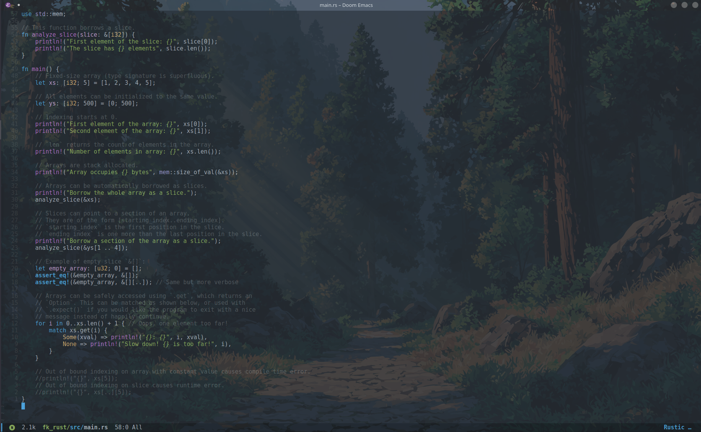

# My Editor Configs

This repository contains my personal configurations for various text editors, with a focus on Emacs. These configurations are designed to streamline my workflow, improve productivity, and add custom features to my editing experience.

The setup includes customized keybindings, themes, package configurations, and utility tweaks that I use regularly. It may also contain my own personal scripts and snippets for specific tasks.

While you are welcome to explore the repository and use parts of the configurations, please keep in mind that they are tailored to my personal preferences and may not work as expected in other environments.

## Screenshot
Here’s a preview of my Emacs setup:

> **Warning**:  
> These configurations are tailored specifically to my personal needs and preferences. They are **not** guaranteed to work outside of my environment. Some settings or plugins may cause issues if used in other setups. Feel free to explore, but **proceed with caution** if you're planning to use them in your own setup.

If you'd like to use parts of this configuration, I recommend carefully reviewing the code and adjusting settings according to your own requirements. Don't forget to back up your existing configuration before making any changes!

---
